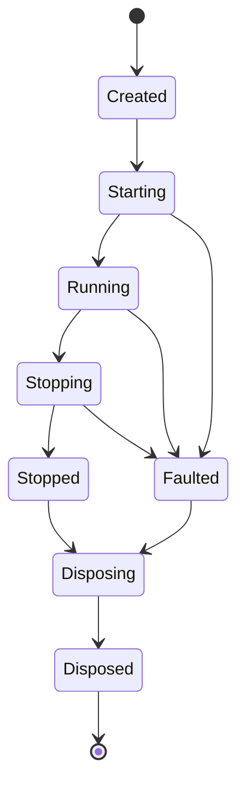

## RecognitionSubsystem Design

### Overview

The RecognitionSubsystem turns audio captured by the AudioSubsystem into text using a model
installed by the ModelManagementSubsystem. It exposes an async Engine/Session API across five
conceptual layers rather than one synchronous recognizer contract: a Layer 3 engine owns one
loaded model and leases exclusive use of it to a Layer 5 session bound to one capture device, so
a host can load a model once and run many sequential or future concurrent-by-device sessions
against it without reloading. It contains the following direct units:

- **ISpeechRecognizerEngine**: the public Layer 3 contract for one loaded, reusable recognition
  engine - `IsAvailable` plus `CreateSessionAsync`, which leases the engine to a new session
- **IRecognitionSession**: the public Layer 5 contract for one streaming recognition session
  bound to one capture device - a forward-only `RecognitionSessionState` machine with
  `StartAsync`/`StopAsync`/`GetResultsAsync`, together with the **RecognitionSessionState**,
  **SessionStateChangedEventArgs**, **SpeechRecognitionResult**, and **SpeechRecognitionEvent**
  value types it uses
- **SpeechRecognizerFactory**: composition root whose `LoadAsync` overloads return a real engine
  or the honest unavailable fallback, and never throw for an ordinary machine state
- **SpeechRecognizerEngine** and **RecognitionSession**: the real Layer 3/5
  implementations, together with the internal
  **IRecognitionBackend**/**IRecognitionBackendFactory** seam, its model-driven
  **DefaultRecognitionBackendFactory** implementation (which asks the model itself to construct
  its backend via `IRecognitionModel.CreateBackend`), the
  **AudioFrameResampler** that converts captured audio into the format a model requires, the
  **RecognitionResultBuffer** backpressure buffer, and the **DedicatedWorker** pump-thread helper.
  The real sherpa-onnx `IRecognitionBackend` implementation, `SherpaOnnxRecognitionEngine`, is not
  part of this subsystem: it lives in the sibling `SpeechSherpa` system - see _SpeechSherpa
  RecognitionSubsystem Design_
- **UnavailableSpeechRecognizerEngine**, **UnavailableRecognitionSession**, and
  **SpeechRecognizerUnavailableException**: honest fallback behavior when no model, no backend,
  or no capture device is available
- **RecognitionEngineBusyException** and **RecognitionSessionFaultedException**: the two new
  fault types introduced by the async redesign, signaling a concurrent lease attempt and a
  mid-session fault surfaced through `GetResultsAsync`, respectively

### Interfaces

The subsystem exposes `ISpeechRecognizerEngine`, `IRecognitionSession`, `RecognitionSessionState`,
`SessionStateChangedEventArgs`, `SpeechRecognitionResult`, `SpeechRecognitionEvent`,
`SpeechRecognizerFactory`, `UnavailableSpeechRecognizerEngine`, `UnavailableRecognitionSession`,
`SpeechRecognizerUnavailableException`, `RecognitionEngineBusyException`, and
`RecognitionSessionFaultedException` as its public API. It consumes `IAudioCaptureDevice` from
the AudioSubsystem for input audio, `IRecognitionModel` from the ModelManagementSubsystem for
backend construction (`CreateBackend`) and the required input format, and `ISpeechDiagnostics`
from the Diagnostics subsystem to report structural composition, lifecycle, and fault facts
without ever exposing recognized text.

No member of the subsystem's public API names a sherpa-onnx type, per this library's
"engine backend stays swappable at the public API surface" decision. No member of the subsystem -
public or internal - names a sherpa-onnx type at all: `IRecognitionModel`'s internal
`CreateBackend` members return the engine-neutral `IRecognitionBackend` seam, and every concrete
engine backend lives in a model-supplying extension such as the sibling `SpeechSherpa` system.

### Design

#### The five-layer vocabulary

The redesign separates "is a model loaded and usable?" from "is one device currently streaming
through it?":

- **Layer 3 - `ISpeechRecognizerEngine`**: owns one loaded `IRecognitionBackend` for one
  recognition model. `IsAvailable` reports whether the machine can recognize at all.
  `CreateSessionAsync(IAudioCaptureDevice, CancellationToken)` leases exclusive use of the engine
  to exactly one live session at a time and returns a new `IRecognitionSession` bound to the
  supplied device.
- **Layer 5 - `IRecognitionSession`**: owns the per-device streaming pipeline - the capture
  subscription, the resampler, the pump thread, and the result buffer - for exactly one
  `StartAsync`/`StopAsync` cycle. A session is single-use: it cannot be restarted after
  `Stopped`.

This mirrors the library's existing "composition is expensive, per-use is cheap" pattern (loading
a model via `SpeechRecognizerFactory.LoadAsync` is the expensive step; creating and running a
session is comparatively cheap), but now makes the two steps independently awaitable, async, and
separately testable, and makes the engine's exclusivity an explicit, observable contract
(`RecognitionEngineBusyException`) rather than an implicit assumption a host had to honor by
convention.

#### Session state machine

`RecognitionSessionState` is a forward-only state machine; no transition other than those shown
below is valid, and `StateChanged` is raised for every transition:

`Faulted` is reachable from `Starting`, `Running`, or `Stopping` - any point where a capture
device can fail or go unavailable mid-session - and is terminal for the ordinary start/stop
cycle: a faulted session is still disposed through the same `Disposing`/`Disposed` path, but
never returns to `Starting` or `Running`. A fault surfaces to a consumer of `GetResultsAsync` as a
`RecognitionSessionFaultedException` thrown from the active enumeration, never silently.

#### Engine exclusivity and lease behavior

`ISpeechRecognizerEngine.CreateSessionAsync` leases the engine's single `IRecognitionBackend` to
exactly one live session (Decision #2 of the async redesign). The real engine implements this
with a `SemaphoreSlim(1, 1)` acquired with a zero timeout: a second `CreateSessionAsync` call
while a session is still live fails fast with `RecognitionEngineBusyException` rather than
queueing or blocking the caller, since a recognition backend genuinely cannot usefully decode two
concurrent streams and silently queueing would hide that fact behind an unbounded wait. The lease
is released when the session created from it is disposed, so a host that always disposes its
sessions (directly or via `await using`) can safely call `CreateSessionAsync` again as soon as the
previous session's `DisposeAsync` completes.

#### Cancellation and abandon policy

Both the pump thread inside `RecognitionSession` and the model-load step inside
`SpeechRecognizerFactory` run on a `DedicatedWorker`: a dedicated, long-running
(`TaskCreationOptions.LongRunning`) thread rather than a pooled thread, because both can block
inside native interop for an unbounded time. `DedicatedWorker` applies a **cooperative-cancel-
then-abandon** policy (Decision #4): on cancellation it signals the delegate's own
`CancellationToken` first, then waits up to a bounded timeout (`DefaultAbandonTimeout`, 2 seconds)
for the delegate to observe it and return; if the delegate has not returned by then, the worker
_abandons_ it - the returned `Task` completes (faulted with `OperationCanceledException`) without
waiting for the native call to return, and the abandonment itself is reported through
`ISpeechDiagnostics` at `Warning` level so a host can see that a native call did not cooperate.
This bounds how long `StopAsync`/`DisposeAsync` can ever block a caller, at the cost of leaving an
abandoned native thread to finish on its own; it never blocks indefinitely on a stuck backend.

#### Backpressure policy

`RecognitionSession` isolates a possibly-slow `GetResultsAsync` consumer from the pump
thread with two independent, bounded buffers (Decision #5):

- Captured-but-not-yet-converted audio queues in a bounded, drop-oldest `Channel<float[]>`
  (`PendingFrameCapacity`, 64 blocks): recognition that has fallen behind live audio cannot be
  caught up by queueing more of it, so the oldest unconverted block is dropped rather than
  growing the backlog without bound.
- Converted results queue in a `RecognitionResultBuffer`: one overwritable "latest provisional"
  slot (an unconsumed provisional is superseded by the next one, never queued) plus a byte-capped
  (`MaxFinalResultBytes`, 64 KiB) FIFO of final results. A final result is only ever evicted when
  the FIFO is full and no new final can otherwise be delivered, and that eviction is itself
  reported through `ISpeechDiagnostics` at `Warning` level, since silently dropping a final result
  without a trace would hide genuine data loss from a slow consumer.

Both policies independently bound the subsystem's steady-state memory and latency instead of
letting either grow without limit when a consumer or the native backend cannot keep up.

#### Composition

`SpeechRecognizerFactory` is the subsystem's composition root. Its `LoadAsync` overloads check,
in order, whether the requested model's files exist on disk and whether the model declares the
recognition role; any failure returns `UnavailableSpeechRecognizerEngine.Instance` with a
structural diagnostic explaining which condition failed. Only then does it ask an
`IRecognitionBackendFactory` to load the model, and a failure there - the missing-native-runtime
case - degrades exactly the same honest way rather than throwing. Loading runs on a
`DedicatedWorker` thread and is awaited by the returned `Task`, so the expensive native-backend
construction never blocks the calling thread. A capture device is bound later, per session, via
`ISpeechRecognizerEngine.CreateSessionAsync` - not here - so one loaded engine can be reused
across many devices or many sequential sessions over its life.

The running pipeline in `RecognitionSession` still spans two threads by design. The
capture device raises frames on a high-priority audio callback thread, so the session's frame
handler does nothing but copy the block into the bounded, drop-oldest queue and return; all
conversion, inference, and result buffering happens on the `DedicatedWorker` pump thread.
`StopAsync` completes the queue and awaits that pump task (subject to the abandon policy above),
so every result derived from audio captured before the stop request is either delivered or
accounted for as an evicted-with-diagnostic final by the time the call returns.

`AudioFrameResampler` performs the format conversion, downmixing to mono and using simple linear
interpolation for rate conversion except on the downsampling path, where a small windowed-sinc
FIR lowpass filter runs immediately before decimation to attenuate above-target-Nyquist energy.
The internal `IRecognitionBackend`/`IRecognitionBackendFactory` seam keeps every native inference
call out of this subsystem entirely: `DefaultRecognitionBackendFactory` simply forwards to the
model's own `IRecognitionModel.CreateBackend`, and the real sherpa-onnx backend
(`SherpaOnnxRecognitionEngine`) lives in the sibling `SpeechSherpa` system (see _SpeechSherpa
RecognitionSubsystem Design_). That seam is the
reason the whole pipeline is verifiable in CI: the session's threading, conversion, fault
containment, and result ordering are all exercised through pure managed fakes with no model file
and no native inference binary present. It mirrors the `IPortAudioApi` seam used for audio
interop and the `IModelDownloadClient` seam used for downloads.

#### UnavailableSpeechRecognizerEngine

**Purpose**: Provide a safe, always-obtainable `ISpeechRecognizerEngine` fallback for use when
recognition is not possible on the current machine.

**Data Model**: No instance fields. Exposes a single static `Instance` singleton; the constructor
is private. `IsAvailable` always returns `false`.

**Key Methods**:

- **CreateSessionAsync(IAudioCaptureDevice, CancellationToken)**: Never throws for the ordinary
  unavailable machine state; returns a completed task holding
  `UnavailableRecognitionSession.Instance` regardless of the supplied device's own availability.
  Still throws `ArgumentNullException` synchronously for a null device, and
  `OperationCanceledException` synchronously for an already-cancelled token, since those are
  caller errors rather than machine states.

**Error Handling**: Never throws for an ordinary unavailable machine state; unavailability is
represented entirely by the returned session's own behavior. A null device or an
already-cancelled token is still a caller error and throws synchronously, same as the real engine.

**Dependencies**: `UnavailableRecognitionSession`; implements `ISpeechRecognizerEngine`.

**Callers**: `SpeechRecognizerFactory.LoadAsync(...)` for every unavailable state.

#### UnavailableRecognitionSession

**Purpose**: Provide a safe, always-obtainable `IRecognitionSession` fallback returned by
`UnavailableSpeechRecognizerEngine.CreateSessionAsync`.

**Data Model**: No instance fields other than the never-invoked backing field for
`StateChanged`. Exposes a single static `Instance` singleton; the constructor is private.
`IsAvailable` always returns `false`; `State` always reports `Created`, since this session never
runs and so never reaches any other state.

**Key Methods**:

- **StartAsync()**: Always throws `SpeechRecognizerUnavailableException`.
- **StopAsync()** / **DisposeAsync()**: Safe no-ops that complete synchronously; this session
  was never running and owns no engine, thread, or native resource, so there is nothing to stop
  or release. Disposal must never throw or invalidate the shared instance, because a host that
  wraps its session in a disposal scope receives this instance and may dispose it repeatedly.
- **GetResultsAsync()**: Throws `SpeechRecognizerUnavailableException` synchronously at the
  point of invocation (not deferred to the first `MoveNextAsync`).
- **StateChanged**: Never raised; subscribing and unsubscribing are safe no-ops.

**Error Handling**: Signals misuse of a known-unavailable session with
`SpeechRecognizerUnavailableException`.

**Dependencies**: `SpeechRecognizerUnavailableException`; implements `IRecognitionSession`.

**Callers**: `UnavailableSpeechRecognizerEngine.CreateSessionAsync(...)` for every call.

#### SpeechRecognizerUnavailableException

**Purpose**: Signal that an operational member of an unavailable recognizer engine or session was
invoked, or that a session that claimed to be available failed on first use.

**Data Model**: No additional fields beyond the standard `Exception` base members.

**Key Methods**: Standard three-constructor exception pattern.

**Error Handling**: This type is itself the error-handling mechanism.

**Dependencies**: `Exception`.

**Callers**: `UnavailableRecognitionSession` for its operational members, and
`RecognitionSession.StartAsync()`/its frame handler when the capture device fails to
start or goes unavailable mid-session.

#### RecognitionEngineBusyException

**Purpose**: Signal that `ISpeechRecognizerEngine.CreateSessionAsync` was called while the
engine's single lease is already held by another live session (see "Engine exclusivity and lease
behavior" above).

**Data Model**: No additional fields beyond the standard `Exception` base members.

**Key Methods**: Standard three-constructor exception pattern.

**Error Handling**: This type is itself the error-handling mechanism; the engine fails fast
(no queueing) rather than blocking the caller.

**Dependencies**: `Exception`.

**Callers**: `SpeechRecognizerEngine.CreateSessionAsync(...)`.

#### RecognitionSessionFaultedException

**Purpose**: Signal, through an active `GetResultsAsync` enumeration, that its session has
transitioned to `RecognitionSessionState.Faulted`.

**Data Model**: No additional fields beyond the standard `Exception` base members.

**Key Methods**: Standard three-constructor exception pattern.

**Error Handling**: This type is itself the error-handling mechanism; it wraps the underlying
cause (for example a `SpeechRecognizerUnavailableException` from a capture device going
unavailable mid-session) as `InnerException`.

**Dependencies**: `Exception`.

**Callers**: `RecognitionResultBuffer.ReadAllAsync(...)` (consumed by
`RecognitionSession.GetResultsAsync`) once the buffer has been faulted.
