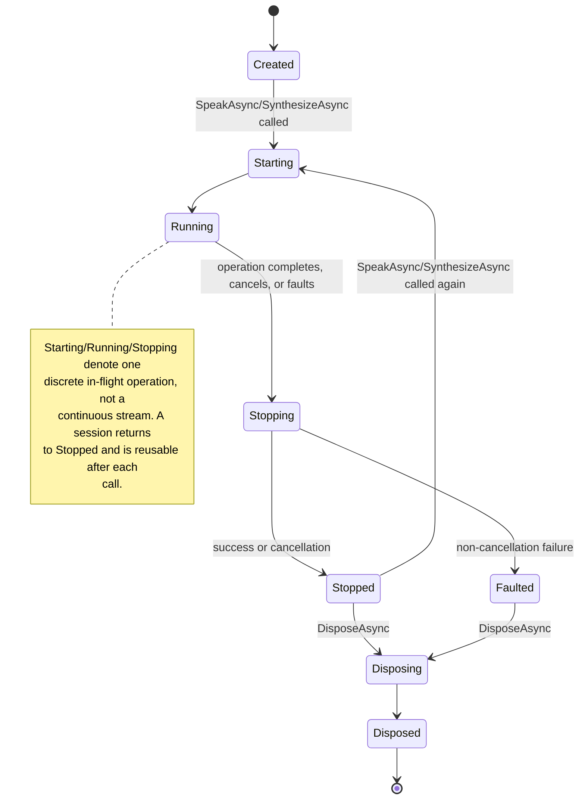

## SynthesisSubsystem Design

### Overview

The SynthesisSubsystem provides text-to-speech capability. It shipped its Layer 1 concern (the
closed, fixed Natural Language Audio Tag vocabulary and the model-independent parser) and its
Layer 2 concern (per-model rendering of a parsed span sequence into a `SpeechPlan`) unchanged by
this redesign. The public and internal text-to-speech API has since been redesigned from a
single, sync-ish `ISpeechSynthesizer` streaming contract to an explicit, 5-layer async
Engine/Session vocabulary that mirrors the RecognitionSubsystem's own Engine/Session redesign:
`ISpeechSynthesizerEngine` (Layer 3 - the public, loaded, expensive, native-backed model, obtained
once) creates cheap, reusable `ISynthesisSession` instances (Layer 5 - one per bound playback
device), each with its own explicit `SynthesisSessionState` lifecycle, so a host no longer has to
reconstruct a synthesizer per utterance to avoid the old type's single-session-per-instance
assumption. The old `ISynthesisEngine`/`ISynthesisEngineFactory` seam was renamed to
`ISynthesisBackend`/`ISynthesisBackendFactory`, freeing the word "engine" for the public Layer 3
contract. `ISynthesisBackend` is public and `ISynthesisBackendFactory` remains internal. It
contains the following direct units:

- **AudioTagParser**: the pure, model-independent scanner, together with the **AudioTagCatalog**
  alias/kind lookup table it consumes and the **NaturalLanguageAudioTag** /
  **NaturalLanguageAudioTagKind** / **TaggedTextSpan** / **TaggedTextSpanKind** value types it
  operates over (unchanged by this redesign)
- **IModelCapabilityProfile** and **DefaultModelCapabilityProfile**: the Layer 2 rendering
  strategy that turns a parsed span sequence into an ordered **SpeechPlan** of **SpeechSegment**s,
  deciding per tag whether to pass it through, approximate it, or strip it, driven purely by the
  selected model's own declared audio-tag support and parameters (unchanged by this redesign)
- **SentenceChunker**: splits synthesis-ready plain text into sentence/clause-sized chunks so
  chunked synthesis has natural-sounding boundaries (unchanged by this redesign)
- **ISpeechSynthesizerEngine**: the public Layer 3 contract for a loaded synthesis model -
  availability, `CreateSessionAsync`, and one-shot `SpeakAsync`/`SynthesizeAsync` convenience
  overloads - together with the **SynthesizedSpeech** value type it and `ISynthesisSession` yield
- **ISynthesisSession**: the public Layer 5 contract for one session bound to one playback
  device - availability, a `SynthesisSessionState` lifecycle with a `StateChanged` event,
  non-overlapping `SpeakAsync`/`SynthesizeAsync` operations, and `StopAsync`
- **SpeechSynthesizerFactory**: composition root that asynchronously loads a real engine or
  returns the honest unavailable fallback, and never throws for an ordinary machine state
- **SpeechSynthesizerEngine**: the real `ISpeechSynthesizerEngine` implementation,
  owning one loaded **SynthesisBackend** (the renamed, public
  **ISynthesisBackend** seam, loaded through the internal
  **ISynthesisBackendFactory** seam and its model-driven
  **DefaultSynthesisBackendFactory** implementation, which asks the model itself to construct its
  backend via `ISynthesisModel.CreateBackend`) and enforcing single-session exclusivity via a
  fail-fast lease. The real sherpa-onnx `ISynthesisBackend` implementation,
  `SherpaOnnxSynthesisEngine`, is not part of this subsystem: it lives in the sibling `SpeechSherpa`
  system - see _SpeechSherpa SynthesisSubsystem Design_
- **SynthesisSession**: the real `ISynthesisSession` implementation, together with the
  **PlaybackAudioResampler** that converts synthesized audio into the format a playback device
  requires
- **SynthesisSessionState** and **SessionStateChangedEventArgs**: the session lifecycle state
  enum and its `StateChanged` event-argument type
- **SynthesisEngineBusyException** and **SynthesisSessionFaultedException**: exceptions signaling
  a lease conflict and a terminal session fault respectively
- **DedicatedWorker**: internal utility applying a cooperative-cancel-then-abandon policy to a
  non-cooperative native synthesis call, synthesis's own duplicated copy of
  RecognitionSubsystem's identically-shaped internal utility
- **UnavailableSpeechSynthesizerEngine**, **UnavailableSynthesisSession**, and
  **SpeechSynthesizerUnavailableException**: honest fallback behavior when no model, no engine
  backend, or no playback device is available

### Interfaces

The subsystem exposes `NaturalLanguageAudioTag`, `NaturalLanguageAudioTagKind`,
`AudioTagDescriptor`, `AudioTagCatalog`, `TaggedTextSpanKind`, `TaggedTextSpan`, `AudioTagParser`
(unchanged), `ISpeechSynthesizerEngine`, `ISynthesisSession`, `SynthesizedSpeech`,
`SynthesisSessionState`, `SessionStateChangedEventArgs`, `SpeechSynthesizerFactory`,
`UnavailableSpeechSynthesizerEngine`, `UnavailableSynthesisSession`,
`SynthesisEngineBusyException`, `SynthesisSessionFaultedException`, and
`SpeechSynthesizerUnavailableException` as its public API. It consumes `IAudioPlaybackDevice` from
the AudioSubsystem for output audio, `ISynthesisModel` from the ModelManagementSubsystem for
backend construction (`CreateBackend`), the preferred playback-format hint, and the Layer 2
rendering strategy, and
`ISpeechDiagnostics` from the Diagnostics subsystem to report structural composition, lifecycle,
and fault facts without ever exposing synthesized text.

No member of the subsystem's public API names a sherpa-onnx type, per this library's
"engine backend stays swappable at the public API surface" decision. No member of the subsystem -
public or internal - names a sherpa-onnx type at all: `ISynthesisModel`'s public `CreateBackend`
member returns the engine-neutral, equally public `ISynthesisBackend` seam, and every concrete
engine backend lives in a model-supplying extension such as the sibling `SpeechSherpa` system (or,
by design, in any third-party package implementing `ISynthesisModel`).

### Design

`AudioTagCatalog` is the single source-of-truth alias table: a static, immutable dictionary
mapping every documented bracket-text alias (already normalized) to its canonical
`NaturalLanguageAudioTag` and `NaturalLanguageAudioTagKind`, built once from the same descriptor
list it also exposes for enumeration (`AudioTagCatalog.Tags`), so the lookup table and the
enumerable report can never drift out of sync with each other. `Normalize` trims, collapses
internal whitespace, and lower-cases bracket-interior text so a caller's exact spacing and casing
never affects resolution.

`AudioTagParser.Parse` is a single-pass scanner with no dependency on the catalog's internal
shape - it looks for `[`...`]` pairs, hands the interior text to
`AudioTagCatalog.TryResolve`, and either emits a `TaggedTextSpanKind.Tag` span (on a match) or
folds the bracket text into the running literal-text buffer (on no match). Per this library's
"never worse than plain narration" guarantee, nothing this parser encounters ever throws or is
silently dropped: an unknown word, an empty bracket, an unclosed bracket, or a stray closing
bracket all become ordinary `TaggedTextSpanKind.PlainText` content, brackets included, exactly as
they appeared in the input. Recognized tag spans are always flushed as their own span, so
adjacent tags and text at either edge of the input never merge with neighboring plain text.

The parser is pure and allocation-light: it holds no state beyond one `StringBuilder` for the
in-progress plain-text run and returns a single ordered `IReadOnlyList<TaggedTextSpan>`. This
makes it trivially unit-testable with plain strings and no model, engine, or device double
required.

`IModelCapabilityProfile.Render(IReadOnlyList<TaggedTextSpan> spans, ISpeechModel model)` is the
Layer 2 rendering strategy: it consumes the model-independent span sequence Layer 1 produced and
turns it into an ordered `SpeechPlan` of `SpeechSegment`s, deciding per tag - based purely on
`model.AudioTagSupport` and `model.Parameters` - whether to pass the tag through as its canonical
bracket text (native support), approximate it as a timed pause or a numeric parameter override on
the surrounding segment (parameter-mapped support), or strip it to plain narration (no support or
no matching convention). `DefaultModelCapabilityProfile.Instance` is a stateless singleton shared
by every model; a model may override `ISynthesisModel.CapabilityProfile` with bespoke rendering
when its native tag support needs something the default cannot express.

`SpeechParameterConventions`, a small internal helper, is where the one, deliberately narrow
mapping from tag to numeric parameter lives: only `Fast`/`VeryFast`/`Slow`/`VerySlow` map to a
speed override (a fraction of the parameter's declared range) and only `Loud`/`Soft`/`Whispers`
map to a volume override; every other tag (every Emotion, every Non-verbal cue, `Breathy`,
`Emphasis`) has no built-in numeric meaning and silently strips under parameter-mapped support.
Pause tags (`ShortPause`/`LongPause`) always render as real silence regardless of a model's
declared support, per this library's explicit "pauses require no model cooperation" decision.
Ordinary narration text between tags is split into `SpeechSegment`s by `SentenceChunker` so the
resulting `SpeechPlan` already has chunk-sized boundaries lined up with natural speech units. A
plain-text chunk whose text ends in a genuine ellipsis additionally renders a longer, distinct
`EllipsisPauseMilliseconds` pause (~500ms, between the tag-triggered short/long pause durations).

`SentenceChunker.Chunk(text, maxLength)` (and its metadata-carrying sibling
`ChunkWithMetadata(text, maxLength)`) splits primary sentence-ending punctuation first, then
unconditionally splits every resulting sentence-level piece further on secondary clause
punctuation (commas, semicolons, colons), falling back to a plain whitespace budget split only
when a piece is still over `maxLength`. A single word that alone exceeds `maxLength` is still
returned whole, never split mid-word. The primary sentence-ending pass treats a maximal run of
consecutive sentence-ending characters (e.g. an ellipsis `...`, or mixed terminators such as
`?!`) as a single boundary. A final merge pass folds any piece whose trimmed text contains no
letter or digit character onto the immediately preceding non-empty chunk, or drops it if none
precedes it. `ChunkWithMetadata.EndsWithEllipsis` reports whether a chunk's final text ends in a
genuine ellipsis, feeding `DefaultModelCapabilityProfile.Render`'s ellipsis-triggered pause.

#### Layer 3/Layer 5 Vocabulary: Engine, Session, and the Lifecycle State Machine

An `ISpeechSynthesizerEngine` represents one loaded synthesis model - expensive to obtain
(`SpeechSynthesizerFactory.LoadAsync` loads native model files), cheap to keep around for a
program's whole life. Calling `CreateSessionAsync(device, cancellationToken)` binds that engine to
one `IAudioPlaybackDevice` and returns an `ISynthesisSession` - cheap to obtain, bound to that one
device for its entire life, and safely reusable across many `SpeakAsync`/`SynthesizeAsync` calls
without reconstruction. This closes the Demo application's "reconstructs a synthesizer per Play"
bug class at the API level: a host now holds one session per device for as long as it needs it,
rather than one short-lived synthesizer per utterance.

At most one session may be leased from a given engine at a time. `SpeechSynthesizerEngine`
enforces this with a fail-fast binary semaphore: `CreateSessionAsync` either acquires the lease
and returns a new session immediately, or - if the lease is already held by a still-undisposed
session - throws `SynthesisEngineBusyException` immediately, never queueing or waiting. The lease
is held for the leased session's entire life and is released exactly once, from that session's
`DisposeAsync`, so a new session can be created again only after the prior one is disposed.
Fail-fast was chosen over waiting because waiting would make `CreateSessionAsync`'s latency depend
on an unrelated session's teardown, with no caller-visible way to bound that wait; a caller that
legitimately wants more than one session simply obtains more than one engine.

Each `ISynthesisSession` exposes an explicit `SynthesisSessionState` lifecycle: `Created`,
`Starting`, `Running`, `Stopping`, `Stopped`, `Disposing`, `Disposed`, `Faulted`. Unlike
recognition's continuous capture-window states, `Starting`/`Running`/`Stopping` denote one
discrete in-flight `SpeakAsync`/`SynthesizeAsync` operation, not a continuous stream: a session
returns to `Stopped` after each operation completes and is immediately ready to accept another
call. The `StateChanged` event reports every transition; a subscriber's handler exception is
caught and routed to diagnostics rather than propagated, so a misbehaving host handler can never
destabilize the session's own lifecycle.

A second `SpeakAsync`/`SynthesizeAsync` call while the session is `Starting`, `Running`, or
`Stopping` throws `InvalidOperationException` immediately rather than queueing: the two methods
on a given session never overlap. This matches the lease's fail-fast philosophy and keeps the
session's own state machine simple - exactly one operation is ever in flight per session. A caller
that genuinely needs concurrent utterances obtains a second session (if the engine's lease
permits) or awaits the first operation's completion.

Once a session faults - any non-cancellation failure during an operation, including a native call
the `DedicatedWorker` had to abandon rather than wait for indefinitely - it transitions to the
terminal `Faulted` state and every subsequent `SpeakAsync`/`SynthesizeAsync` call throws
`SynthesisSessionFaultedException`, wrapping the original fault as its inner exception. A faulted
session cannot resume; the caller must dispose it (releasing the engine's lease) and create a
replacement. `StopAsync` requests cooperative cancellation of whichever operation is currently in
flight (a no-op when none is) by cancelling that operation's own linked `CancellationTokenSource`;
the operation then unwinds through `Stopping` to `Stopped`, not `Faulted`, since a caller-requested
stop is an ordinary, successful outcome rather than a fault.

`SynthesisSession`'s per-operation pipeline normalizes the input text, tag-parses it,
Layer 2 renders it into a `SpeechPlan`, then synthesizes each `SpeechSegment` in turn: unlike the
former streaming synthesizer, synthesis is no longer pipelined ahead of playback across an
unbounded/bounded channel - each segment is synthesized, then (for `SpeakAsync`) immediately
written to the bound playback device, before the next segment's synthesis begins. This keeps the
per-call state machine simple (one backend call in flight at a time) while still overlapping this
call's own synthesis-then-playback work normally, since playback of one segment and synthesis of
the next both still happen without the caller waiting for the whole plan up front. Each segment's
native `Generate` call runs through `DedicatedWorker.Run`, so a non-cooperative native call is
bounded by the cooperative-cancel-then-abandon policy (see below) rather than awaited
indefinitely. A pause segment (empty text) skips the backend entirely and produces pure silence
directly. For `SpeakAsync`, once every segment has been written, `WaitForPlaybackDrainAsync` polls
`IAudioPlaybackDevice.PendingSampleCount` until it reaches zero, plus a small fixed tail margin,
before stopping the device - genuinely waiting for the hardware to finish rendering rather than
treating "every segment enqueued" as "finished playing". A `finally` block stops the playback
device regardless of whether the loop, the drain wait, or neither completed, faulted, or was
cancelled, reporting (but not rethrowing) a failure to stop so the device is never left running.
`PlaybackAudioResampler` performs the playback-direction format conversion - resample from the
backend's actual rate to the device's resolved rate using a small windowed-sinc FIR
anti-aliasing step before downsampling decimation, then upmix mono to the device's channel
count - mirroring `AudioFrameResampler`'s identical recognition-direction role. The public
`ISynthesisBackend` seam, loaded through the internal `ISynthesisBackendFactory` seam (renamed
from `ISynthesisEngine`/`ISynthesisEngineFactory`, members unchanged), keeps every native
inference call out of this subsystem entirely: `DefaultSynthesisBackendFactory` simply forwards
to the model's own `ISynthesisModel.CreateBackend`, and the real sherpa-onnx backend
(`SherpaOnnxSynthesisEngine`) lives in the sibling `SpeechSherpa` system (see _SpeechSherpa
SynthesisSubsystem Design_), so the whole pipeline is verifiable in CI with pure managed fakes.

`DedicatedWorker.Run` applies a cooperative-cancel-then-abandon policy to a delegate run on a
dedicated `TaskCreationOptions.LongRunning` task: on cancellation it waits a bounded,
injectable `DefaultAbandonTimeout` (2 seconds) for the delegate to stop cooperatively; if it has
not stopped by then, the worker reports a `Warning` diagnostic, detaches the still-running task
(observing, rather than propagating, whatever exception it eventually produces, so it can never
become an unobserved-exception crash), and throws `OperationCanceledException` to its own caller.
This is `SynthesisSubsystem`'s own duplicated copy of `RecognitionSubsystem`'s identically-shaped
internal utility: sharing it would require standing up a third, shared internal subsystem for one
~100-line utility, judged disproportionate to the duplication it would remove, and each
subsystem's copy is already fully covered by its own subsystem-scoped tests.

`ISpeechSynthesizerEngine.SpeakAsync(device, text, cancellationToken)` and
`SynthesizeAsync(text, cancellationToken)` are one-shot convenience overloads: each internally
calls `CreateSessionAsync`, performs exactly one operation, and disposes the session before
returning (or faulting) - the common case of a single isolated utterance, without the caller
needing to manage a session's life at all. `SynthesizeAsync` (both on the engine and on a session)
needs no playback device at all: it returns the full, ordered `IReadOnlyList<SynthesizedSpeech>`
segment list produced by the plan, including pure-silence pause segments, so a caller that only
wants the synthesized audio (for example to save it, or to play it through a custom pipeline) can
get full fidelity without ever touching a playback device.

#### ISpeechSynthesizerEngine

**Purpose**: Define the public Layer 3 contract for a loaded, reusable text-to-speech model, so
hosts and tests can depend on synthesis behavior without depending on a specific inference engine
or native audio type.

**Data Model**: `IsAvailable` indicates whether this engine is backed by a loaded native model.
The adjacent `SynthesizedSpeech` record carries one segment's normalized `Samples`, the
`SampleRate` they were produced at, and the real `PreSilence`/`PostSilence` durations to play
alongside them.

**Key Methods**:

- **CreateSessionAsync(device, cancellationToken)**: Binds this engine to one playback device and
  returns a reusable `ISynthesisSession`. Throws `SynthesisEngineBusyException` if another leased
  session is still undisposed.
- **SpeakAsync(device, text, cancellationToken)**: One-shot convenience - creates a session, speaks
  once, disposes the session.
- **SynthesizeAsync(text, cancellationToken)**: One-shot convenience - creates a session with no
  device needed, returns the full-fidelity segment list, disposes the session.
- **DisposeAsync()**: Releases the engine's native resources. Disposes any still-active leased
  session first. Idempotent.

**Error Handling**: Real implementations and the unavailable fallback both use
`SpeechSynthesizerUnavailableException` when an operational call is invalid because no usable
engine is available.

**Dependencies**: `SynthesizedSpeech`, `ISynthesisSession`, `SynthesisEngineBusyException`,
`SpeechSynthesizerUnavailableException`.

**Callers**: `SpeechSynthesizerFactory.LoadAsync(...)` and hosts that speak synthesized text.

#### ISynthesisSession

**Purpose**: Define the public Layer 5 contract for one session bound to one playback device for
its entire life, cheap to obtain and safely reusable across many calls.

**Data Model**: `IsAvailable` reflects disposal/fault status. `State` exposes the current
`SynthesisSessionState`; `StateChanged` reports every transition.

**Key Methods**:

- **SpeakAsync(text, cancellationToken)**: Synthesizes and plays text through the bound device.
  Throws `InvalidOperationException` if called while another operation is already in flight.
- **SynthesizeAsync(text, cancellationToken)**: Synthesizes text and returns the full-fidelity
  segment list without playing it. Same overlap rule as `SpeakAsync`.
- **StopAsync(cancellationToken)**: Requests cooperative cancellation of the in-flight operation,
  if any. Safe no-op otherwise.
- **DisposeAsync()**: Cancels any in-flight operation, transitions to `Disposed`, and releases the
  engine's exclusivity lease exactly once. Idempotent.

**Error Handling**: `SpeechSynthesizerUnavailableException` when unavailable;
`SynthesisSessionFaultedException` once `Faulted`; `InvalidOperationException` on overlap;
`ObjectDisposedException` after disposal.

**Dependencies**: `SynthesizedSpeech`, `SynthesisSessionState`, `SessionStateChangedEventArgs`,
`SynthesisSessionFaultedException`, `SpeechSynthesizerUnavailableException`.

**Callers**: `ISpeechSynthesizerEngine.CreateSessionAsync(...)` callers and its own one-shot
convenience overloads.

#### SpeechSynthesizerFactory

**Purpose**: Provide the single composition entry point for obtaining an
`ISpeechSynthesizerEngine`, so all "can this machine speak right now?" logic lives in one
reviewable place, mirroring `SpeechRecognizerFactory`. Unlike the former synchronous factory, this
type no longer takes a playback device: an engine loaded here can create many sessions over its
life, each bound to its own device, via `ISpeechSynthesizerEngine.CreateSessionAsync`. The
blocking native model load itself runs on a `DedicatedWorker` rather than the calling thread, so
awaiting any `LoadAsync` overload never blocks a caller's synchronization context.

**Data Model**: A static class with no state. The public `LoadAsync(...)` overloads compose
against the real model-driven `DefaultSynthesisBackendFactory`, which forwards to
`ISynthesisModel.CreateBackend`; internal overloads accept an injected
`ISynthesisBackendFactory` so composition can be verified without model files or a native runtime.

**Key Methods**:

- **LoadAsync(ISynthesisModel model, string installedModelDirectory, ISpeechDiagnostics?
  diagnostics, IReadOnlyDictionary&lt;string, object&gt;? parameterValues, CancellationToken
  cancellationToken)**: Returns a real `SpeechSynthesizerEngine` when the model's
  installed directory exists, the model declares `SpeechModelRole.Synthesis`, and the backend
  loads. Otherwise returns `UnavailableSpeechSynthesizerEngine.Instance`. Precondition: `model` is
  non-null. Postcondition: the returned engine is never null, and either owns a loaded backend or
  is the shared unavailable instance. The optional `parameterValues` bag (for example a selected
  voice) is forwarded unchanged to the constructed engine and re-resolved via
  `ISynthesisModel.ResolveSpeakerId` once per synthesized segment.
- **LoadAsync(ISynthesisModel model, SpeechModelStore store, ...)** / **LoadAsync(ISynthesisModel
  model, SpeechModelCatalog catalog, ...)**: Convenience overloads that resolve the model's
  installed-files directory from the supplied store/catalog before delegating to the overload
  above.

The checks run in the same deliberate order as the recognition-direction factory - parameter
validation, then installed, then role, then backend load - so the cheapest and most common cause
of unavailability (a model not downloaded yet) is reported first and no native memory is allocated
for an engine that could never run.

**Error Handling**: Every ordinary machine state is represented as the honest unavailable engine
plus a structural diagnostic, never as an exception, per this library's "nothing throws at
composition" decision. A backend load failure is caught and degraded identically to a missing
model. Only a null `model`/`store`/`catalog`, an invalid `parameterValues` entry
(`ArgumentException`), or a cancelled `cancellationToken` (`OperationCanceledException`) throws,
since those are programming errors or an explicit caller request rather than a machine state.

**Dependencies**: `ISynthesisModel` and `SpeechModelRole` from the ModelManagementSubsystem,
`ISpeechDiagnostics`/`NullSpeechDiagnostics` from the Diagnostics subsystem, and the subsystem's
own `ISynthesisBackendFactory`, `DefaultSynthesisBackendFactory`,
`SpeechSynthesizerEngine`, and `UnavailableSpeechSynthesizerEngine`.

**Callers**: Host applications composing speech synthesis at start-up, and the system-level
integration tests.

#### UnavailableSpeechSynthesizerEngine

**Purpose**: Provide a safe, always-obtainable `ISpeechSynthesizerEngine` fallback for use when
synthesis is not possible on the current machine.

**Data Model**: No instance state. Exposes a single static `Instance` singleton; the constructor
is private. `IsAvailable` always returns `false`.

**Key Methods**:

- **CreateSessionAsync(device, cancellationToken)**: Always succeeds, returning the shared
  `UnavailableSynthesisSession.Instance` - binding a device to an already unavailable engine is an
  ordinary (if useless) composition, not an error. Throws `ArgumentNullException` for a null
  `device`.
- **SpeakAsync(...)** / **SynthesizeAsync(...)**: Always throw
  `SpeechSynthesizerUnavailableException`.
- **DisposeAsync()**: A no-op that never throws and never invalidates `Instance`.

**Error Handling**: Obtaining and holding the instance never throws. Only the operational members
throw, and only when actually invoked.

**Dependencies**: `SpeechSynthesizerUnavailableException`, `UnavailableSynthesisSession`;
implements `ISpeechSynthesizerEngine`.

**Callers**: `SpeechSynthesizerFactory.LoadAsync(...)` when the model is not installed, the
model's role is not synthesis, or the backend cannot be loaded.

#### UnavailableSynthesisSession

**Purpose**: Provide the honest `ISynthesisSession` fallback returned by
`UnavailableSpeechSynthesizerEngine.CreateSessionAsync`.

**Data Model**: No instance state. Exposes a single static `Instance` singleton. `IsAvailable`
always returns `false`; `State` always reports `SynthesisSessionState.Created` (it never
transitions).

**Key Methods**:

- **SpeakAsync(...)** / **SynthesizeAsync(...)**: Always throw
  `SpeechSynthesizerUnavailableException`. Throw `ArgumentNullException` for null `text`.
- **StopAsync(...)**: A safe no-op, since no operation is ever in flight.
- **DisposeAsync()**: A no-op that never throws and never invalidates `Instance`.

**Error Handling**: Mirrors `UnavailableSpeechSynthesizerEngine`.

**Dependencies**: `SpeechSynthesizerUnavailableException`; implements `ISynthesisSession`.

**Callers**: `UnavailableSpeechSynthesizerEngine.CreateSessionAsync(...)`.

#### SpeechSynthesizerUnavailableException

**Purpose**: Signal that an operational member of an unavailable engine or session was invoked, or
that a session which claimed to be available faulted and was asked to operate again.

**Data Model**: No additional fields beyond the standard `Exception` base members.

**Key Methods**: Standard three-constructor exception pattern.

**Error Handling**: This type is itself the error-handling mechanism.

**Dependencies**: `Exception`.

**Callers**: `UnavailableSpeechSynthesizerEngine` and `UnavailableSynthesisSession` for every
operational member.

#### SynthesisEngineBusyException

**Purpose**: Signal that `ISpeechSynthesizerEngine.CreateSessionAsync` was called while this
engine's exclusivity lease is already held by another, still-undisposed session.

**Data Model**: No additional fields beyond the standard `Exception` base members.

**Key Methods**: Standard constructor pattern.

**Dependencies**: `Exception`.

**Callers**: `SpeechSynthesizerEngine.CreateSessionAsync`.

#### SynthesisSessionFaultedException

**Purpose**: Signal that a `SpeakAsync`/`SynthesizeAsync` call was made on a session that has
already transitioned to `SynthesisSessionState.Faulted`.

**Data Model**: Carries the original fault as its `InnerException`.

**Key Methods**: Standard constructor pattern taking a message and the original fault.

**Dependencies**: `Exception`.

**Callers**: `SynthesisSession`'s operation entry point, once faulted.

#### Design Constraints

**Volume is applied as post-hoc amplitude scaling, not a native engine parameter.** sherpa-onnx's
offline TTS API has no volume/gain input, so a `Loud`/`Soft`/`Whispers` tag's numeric override is
applied by scaling the generated segment's samples and clamping to `[-1.0, 1.0]`, rather than
being passed into `Generate(...)`.

**Speed is applied as a native engine parameter.** Unlike volume, sherpa-onnx's `Generate(text,
speed, speakerId)` already accepts a speed multiplier, so a `Fast`/`VeryFast`/`Slow`/`VerySlow`
tag's override is passed straight through rather than post-processed.

**Voice/speaker selection is a session-level concern, not a per-segment override.** The
`speakerId` argument to `Generate(...)` is resolved once per segment by calling
`ISynthesisModel.ResolveSpeakerId(parameterValues)` against the constructor-supplied
`parameterValues` bag - deliberately _not_ reused via the per-segment `ParameterOverrides`
mechanism above, which is Natural Language Audio Tag-scoped and transient. A selected voice, by
contrast, applies to the whole session, so it is threaded through the constructor instead and
re-resolved fresh per segment (cheap and pure) rather than cached once for the whole session.

**Synthesized text is never reported through diagnostics.** Every diagnostic this subsystem emits
is a structural fact - composed, started, stopped, faulted, or lease-related - and never includes
synthesized text, honoring the same `ISpeechDiagnostics` contract the recognition direction
honors for recognized text.

**Engine exclusivity fails fast rather than queueing.** A concurrent `CreateSessionAsync` call
while a lease is held throws `SynthesisEngineBusyException` immediately rather than waiting for
the held session to be disposed, so a caller's latency never depends on an unrelated session's
teardown with no caller-visible way to bound that wait.

**`DedicatedWorker` is duplicated, not shared, between subsystems.** Standing up a third, shared
internal subsystem for one ~100-line utility was judged disproportionate to the duplication it
would remove; each subsystem's copy is independently and fully covered by its own tests.
